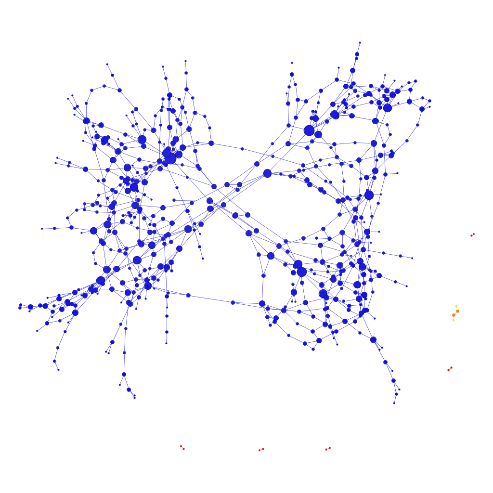
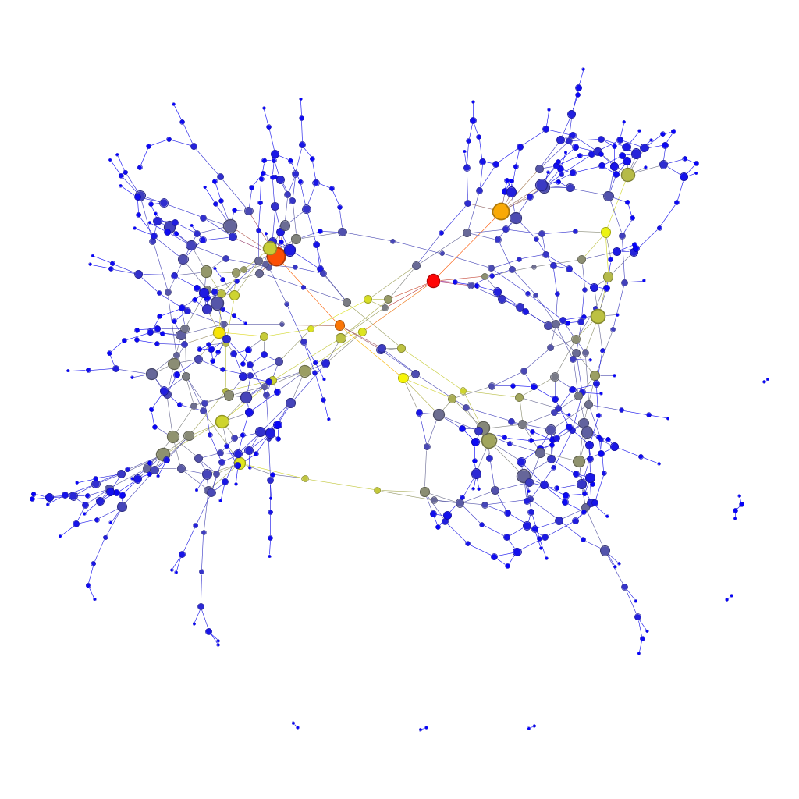
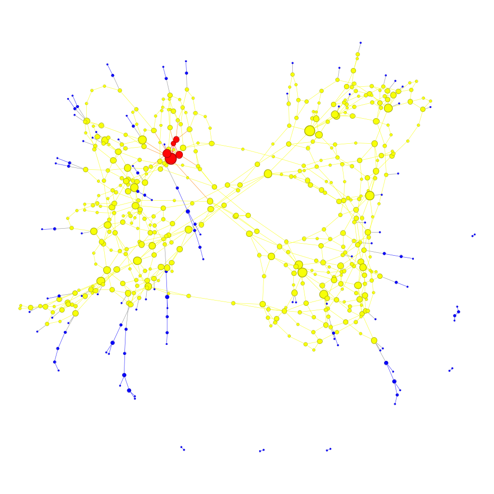

# Visualização e Avaliação de Métricas de Centralidade em Grafos Utilizando Gephi


by <br/>
[Daniel Bruno Trindade da Silva](https://github.com/daniel-trindade) <br/>
[Maria Eduarda Lima da Luz](https://github.com/marialluz) <br/>

***

## Vídeo de Apresentação

<a href="https://youtu.be/6qA9rjIAEvk" target="_blank">
  
</a>

***

## Introdução

A análise de redes complexas tem se tornado uma ferramenta essencial em diversas áreas do conhecimento. Os grafos permitem modelar e estudar sistemas onde as conexões entre elementos são tão relevantes quanto os próprios elementos.

Neste contexto, as métricas de centralidade são fundamentais para identificar os nós mais importantes ou influentes dentro de uma rede. Métricas como grau (degree), centralidade de proximidade (closeness centrality), centralidade de intermediação (betweenness centrality) e centralidade por autovetor (eigenvector centrality) fornecem diferentes perspectivas sobre a posição e a função estrutural de cada nó.

Este trabalho tem como objetivo realizar a análise de uma rede previamente construída, utilizando a ferramenta Gephi para gerar visualizações que destaquem as principais características estruturais da rede. Os tamanhos dos vértices serão proporcionais ao número de vizinhos (grau), enquanto as cores representarão diferentes métricas de centralidade. Além disso, será adotado um layout que facilite a percepção visual dessas variações, permitindo uma interpretação intuitiva e informativa da rede.

## Metodologia


### Processamento e Modelagem de Dados

Os dados que foram utilizados foram fornecidos pelo professor responsável pela disciplina. São o  [GraphTest_nodes](./Base%20de%20dados/GraphTest_nodes.txt)  que possui as informações pertinentes aos vertices e [GraphTest_edges](./Base%20de%20dados/GraphTest_edges.txt) que possui as informações pertinentes as arestas.

Para a etapa de processamento e modelagem dos dados, foi utilizado um [script Python](./Final_Project.ipynb) que emprega as bibliotecas pandas e NetworkX. 

Este script lê os arquivos, constroi o grafo, realiza um pré-processamento para tratar valores ausentes ou não numéricos e ao final prepara e exporta o grafo em um arquivo de formato GEXF que mais tarde seria necessário para gerar as visualizações no **Gephi**.

### Analise e Visualização da Rede

De posse do grafo gerado, utilizamos o software **Gephi**, uma ferramenta de código aberto amplamente utilizada para exploração e representação de grafos e redes complexas.

Inicialmente, a rede foi importada para o **Gephi**, onde foram aplicadas as métricas de centralidade disponíveis no módulo de estatísticas. Para este estudo, escolheu-se representar visualmente os nós com base em duas dimensões principais:

- **Tamanho dos vértices:** definido de forma proporcional ao grau de cada nó, ou seja, ao número de vizinhos diretamente conectados a ele. Essa abordagem facilita a identificação dos nós com maior conectividade local.

- **Cores dos vértices:** Em cada uma das visualizaçõpes são atribuidas atribuídas com base em uma métrica de centralidade global (Closeness, Betweenness, Degrees ou Eigenvector Centrality). Utilizou-se uma escala de cores contínua do azul ao vermelho, passando pelo amarelo, conforme expresso a seguir:

    - **Azul** representa os nós com menor valor na métrica escolhida;
    - **Amarelo** representa valores intermediários;
    - **Vermelho** representa os nós com os maiores valores, ou seja, os mais influentes de acordo com a centralidade analisada.

Para o posicionamento espacial dos nós na visualização, foi utilizado o layout ForceAtlas 2, um algoritmo de distribuição de grafos baseado em forças físicas. Esse layout é especialmente eficaz para evidenciar a estrutura da rede, agrupando vértices densamente conectados e separando regiões menos conectadas. Além disso, ele contribui para a percepção visual das variações de cor e tamanho, o que facilita a interpretação das métricas aplicadas.

Todas as imagens geradas foram exportadas diretamente do _Gephi_ após a aplicação dos layouts e ajustes visuais, como espessura das arestas, proporção dos nós e paleta de cores adequada.

### K-cores e K-shels

Para realizar a análise de coesão da rede, foi [implementado um algoritmo em Python](./k-cores/core_calc.py) para a decomposição do grafo em seus k-cores e k-shells. Uma das dificuldades encontradas foi de que a função ```core_number``` da biblioteca NetworkX, utilizada, não suporta diretamente a estrutura MultiGraph usada inicialmente. Para contornar essa limitação, foi adotado o seguinte processo:

1. **Criação de um Grafo Simples:** Primeiramente, uma cópia simplificada do grafo original foi criada. Este processo converte o MultiGraph em um Graph, colapsando todas as arestas múltiplas entre dois nós em uma única aresta.

2. **Cálculo do Número do Core:** Com o grafo simplificado, a função ```nx.core_number()``` foi executada com sucesso. A função calculou o número do core para cada nó da rede, retornando um dicionário onde cada nó é associado a um número inteiro que representa o k-shell ao qual pertence.

3. **Atribuição dos Resultados ao Grafo Original:** Os números de core calculados foram então adicionados como um novo atributo, nomeado core_number, aos nós do MultiGraph original.

Ao final do processo, o MultiGraph atualizado, agora contendo as informações de k-core, foi exportado para um novo arquivo GEXF. Isso permitiu que na etapa de visualização no Gephi, os nós pudessem ser filtrados e coloridos de acordo com o seu core_number, facilitando a identificação e o destaque do núcleo mais coeso da rede e de suas camadas adjacentes (shells).

## Resultados

### Analise de Centralidade

As métricas de centralidade foram calculadas para identificar os nós mais importantes da rede de acordo com diferentes critérios. Conforme solicitado, o grau foi mapeado para o tamanho dos nós e as demais métricas foram representadas por uma escala de cores.

#### Centralidade de Grau (Node Degree)

A centralidade de grau quantifica o número de conexões diretas de um nó. Na visualização, o tamanho de cada nó é diretamente proporcional ao seu grau. Nós maiores, portanto, são hubs que possuem um alto número de interações. A Figura 1 demonstra que a rede possui vários nós com grau elevado, que se destacam visualmente e atuam como pontos centrais de conexão local.


Figura 1: Rede com o tamanho dos nós proporcional à sua Centralidade de Grau.

Esssa métrica foi representada na rede em produção, que pode ser acessada [aqui](https://marialluz.github.io/netdeploy/network/)

#### Centralidade de Proximidade (Closeness Centrality)

A centralidade de proximidade mede a "distância" média de um nó para todos os outros nós da rede. Nós com alta proximidade (em amarelo/vermelho na Figura 2) estão em uma posição topologicamente favorável para alcançar rapidamente qualquer outro nó, sendo eficientes na disseminação de informação através do grafo.


Figura 2: Centralidade de Proximidade, onde cores mais quentes (amarelo/vermelho) indicam maior centralidade.

#### Centralidade de Intermediação (Betweenness Centrality)

A centralidade de intermediação destaca os nós que funcionam como "pontes", pois estão no caminho mais curto entre muitos outros pares de nós. A Figura 3 mostra que os nós com maior intermediação (em amarelo/vermelho) são cruciais para a conectividade da rede, pois sua remoção poderia desconectar ou dificultar a comunicação entre diferentes clusters.


Figura 3: Centralidade de Intermediação. Nós em cores quentes atuam como pontes na rede.

#### Centralidade de Autovetor (Eigenvector Centrality)

Esta métrica mede a influência de um nó com base na importância de seus vizinhos. Um nó tem alta centralidade de autovetor se ele está conectado a outros nós também bem conectados. Na Figura 4, os nós em cores mais quentes são os mais influentes, atuando como líderes dentro de seus respectivos agrupamentos e na rede como um todo.


Figura 5: Centralidade de Autovetor, destacando os nós mais influentes da rede.

### Análise de Coesão da Rede: Decomposição k-core
Para investigar a robustez e a estrutura de coesão da rede, foi realizada a decomposição k-core, conforme solicitado. A análise revelou que a rede é composta por shells que vão de k=0 até k=3, sendo o 3-core o núcleo mais denso e coeso. As figuras a seguir ilustram as principais camadas (shells) da rede.

A **1-shell**, destacada em azul na Figura 6, representa os nós mais periféricos da rede. São os elementos menos conectados e mais suscetíveis a serem desconectados.


Figura 6: Destaque para a 1-shell (nós com core number = 1).

A **2-shell** (Figura 7), em amarelo constitui o corpo principal da rede. É uma subestrutura significativamente mais coesa que a camada anterior e abriga a grande maioria dos nós.


Figura 7: Destaque para a 2-shell.

Finalmente, o **3-core** (Figura 8), em vermelho é o núcleo mais interno e robusto da rede. Embora contenha poucos nós, este grupo é caracterizado por uma alta densidade de conexões internas, representando a subestrutura mais resiliente do grafo, provavelmente essencial para sua função e estabilidade.


Figura 8: Destaque para o 3-core (nós com core number = 3), o núcleo mais coeso da rede.


## Conclusão

Este trabalho cumpriu com sucesso o objetivo de analisar uma rede complexa, aplicando os conhecimentos teóricos e práticos da disciplina de Grafos e Estruturas Complexas. A metodologia, que combinou o poder de processamento do Python para a modelagem dos dados e a capacidade de visualização interativa do Gephi para a análise, provou-se eficaz para extrair insights valiosos sobre a estrutura e as propriedades da rede.

A análise de centralidade permitiu uma compreensão multifacetada da importância dos nós. A centralidade de grau revelou os hubs de interação; a de proximidade, os nós mais eficientes para a disseminação de informação; a de intermediação, os "gargalos" ou pontes críticas para a coesão da rede; e a de autovetor, os nós mais influentes dentro de seus agrupamentos.

Um dos resultados mais significativos foi a análise de coesão através da decomposição k-core. A identificação de um núcleo denso e robusto (o 3-core), mesmo que pequeno em número de nós, evidencia a existência de uma subestrutura altamente interconectada que é provavelmente fundamental para a estabilidade e função da rede. As camadas ou "shells" que o circundam revelam uma organização hierárquica, desde este núcleo resiliente até os nós mais periféricos.

Em suma, o projeto demonstrou na prática como as métricas de grafos podem ser utilizadas para decodificar a complexidade de uma rede, transformando dados brutos de nós e arestas em um mapa estruturado que revela hierarquias, pontos críticos e a organização geral do sistema.
