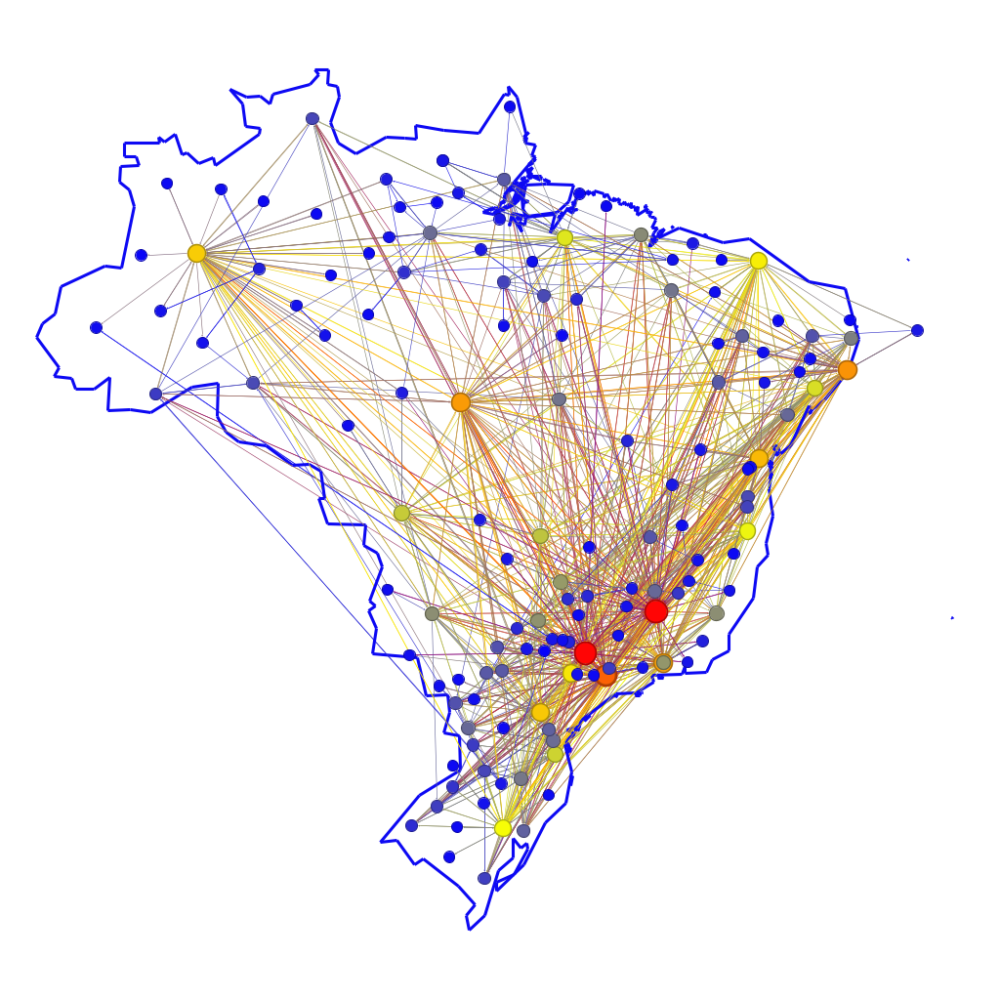

# Análise Estrutural da Malha Aérea Brasileira em 2024: Um Estudo de Centralidade e K-Core

by  
[Daniel Bruno Trindade da Silva](https://github.com/daniel-trindade)  
[Maria Eduarda Lima da Luz](https://github.com/marialluz)  

***

## Vídeo de Apresentação

## Webpage com grafo em produção

***

## 1. Introdução

A malha aérea brasileira constitui uma infraestrutura vital para um país de dimensões continentais como o Brasil, sendo fundamental para a integração econômica, a conectividade social e a logística nacional. O sistema, composto por centenas de aeroportos e milhares de rotas, forma uma teia intrincada de conexões cujo funcionamento e hierarquia não são trivialmente aparentes. Para compreender a sua complexa estrutura e dinâmica, podemos modelá-la como uma rede complexa, aplicando os conceitos da teoria dos grafos para revelar padrões ocultos.

Neste modelo, modelamos os aeroportos como vértices (ou nós) e as rotas de voo diretas que os conectam como arestas (ou links). Essa abordagem nos permite ir além de uma simples análise geográfica, quantificando a importância e o papel de cada aeroporto dentro do sistema aéreo nacional.

O presente relatório tem como objetivo principal analisar a estrutura da malha aérea brasileira utilizando como base de dados todos os voos comerciais registrados pela Agência Nacional de Aviação Civil (ANAC) durante o ano de 2024. Através da ferramenta de visualização e análise de redes Gephi, buscaremos atingir os seguintes objetivos específicos:

1. Identificar os principais hubs aéreos através da análise de métricas de centralidade, como Grau, Centralidade de Intermediação e Centralidade de Autovetor, diferenciando aeroportos de acordo com seu volume de conexões e sua importância como "pontes" na rede.

2. Investigar a coesão e a resiliência da malha por meio da decomposição k-core, destacando o "núcleo" de aeroportos mais densamente conectados que formam o esqueleto estrutural da aviação nacional.

3. Analisar a distribuição estatística das conexões, verificando a hierarquia da rede e identificando os aeroportos que se encontram no centro e na periferia do sistema.

Ao longo deste relatório, cada uma dessas análises será detalhada, acompanhada de visualizações gráficas e interpretações dos resultados, fornecendo um panorama completo da estrutura, hierarquia e funcionamento da aviação comercial no Brasil em 2024.

## 2. Metodologia

A metodologia empregada neste estudo foi estruturada em cinco etapas principais: (1) obtenção e coleta de dados, (2) pré-processamento e filtragem, (3) enriquecimento de dados com coordenadas geográficas, (4) construção do modelo de rede e cálculo de métricas primárias, e (5) análise e visualização gráfica no software Gephi. Essas etapas foram feitas usando o Google Colab, clique [aqui](./processamento_dos_dados.ipynb) para ver o script utilizado.

### 2.1. Obtenção e Coleta de Dados

A base de dados fundamental para esta análise foi extraída do [portal de Dados Abertos da Agência Nacional de Aviação Civil (ANAC)](https://sistemas.anac.gov.br/dadosabertos/Voos%20e%20opera%C3%A7%C3%B5es%20a%C3%A9reas/Voo%20Regular%20Ativo%20%28VRA%29/2024/). Foram utilizados os arquivos referentes à "Base de Dados de Voos e Frequências Aéreas (VRA)", que detalham todos os voos comerciais realizados no espaço aéreo brasileiro. Os dados, disponibilizados em arquivos no formato CSV (Comma-Separated Values) segmentados mensalmente, correspondem a todo o ano de 2024. A primeira etapa consistiu em agregar os 12 arquivos mensais em um único conjunto de dados, que totalizou 987.868 registros de voos, incluindo operações domésticas e internacionais.

### 2.2. Pré-processamento e Filtragem dos Dados

Com o objetivo de isolar o escopo do estudo para a malha doméstica, foi aplicado um filtro para selecionar exclusivamente os voos de natureza nacional. Esta etapa reduziu o universo de análise para 796.923 voos. A seguir, realizou-se uma etapa de seleção de atributos (feature selection) para otimizar o dataset. Colunas que não eram relevantes para a análise estrutural da rede, como informações sobre horários de partida, atrasos e datas específicas, foram descartadas. O dataframe resultante preservou apenas as seguintes colunas essenciais: [ICAO](https://pt.wikipedia.org/wiki/C%C3%B3digo_aeroportu%C3%A1rio_ICAO) Empresa Aérea, Número Voo, Código Tipo Linha, ICAO Aeródromo Origem e ICAO Aeródromo Destino.

### 2.3. Enriquecimento de Dados: Geocodificação dos Aeroportos

Para viabilizar uma visualização geoespacial da rede através do layout GeoLayout do Gephi, onde cada aeroporto é posicionado em sua localização real, foi necessário obter as coordenadas geográficas (latitude e longitude) de cada um dos 215 aeroportos únicos identificados no dataframe. Para isso, foi desenvolvido um script em Python que, utilizando a biblioteca GeoPy e o serviço de geocodificação Nominatim, iterou sobre a lista de códigos [ICAO](https://pt.wikipedia.org/wiki/C%C3%B3digo_aeroportu%C3%A1rio_ICAO) dos aeroportos e buscou suas respectivas coordenadas. As coordenadas de latitude e longitude de cada aeroporto foram então incorporadas ao dataframe principal como novos atributos.

### 2.4. Construção da Rede e Cálculo de Métricas

A partir do dataframe tratado e enriquecido, a rede foi construída. Neste modelo:

 - Cada aeroporto único foi definido como um vértice (nó) da rede.

 - Uma aresta (link) não-direcionada foi estabelecida entre dois vértices sempre que havia ao menos um voo registrado entre eles.

Posteriormente, um segundo script em Python, utilizando a biblioteca NetworkX, foi empregado para realizar a decomposição k-core da rede. O valor de k-core de cada vértice foi calculado e adicionado como um novo atributo ao grafo, permitindo uma análise posterior de sua coesão estrutural.

### 2.5. Análise e Visualização no Gephi

O grafo final, contendo os vértices, arestas ponderadas, coordenadas geográficas e atributos de k-core, foi exportado em formato GEXF e importado na plataforma de análise de redes Gephi. Dentro do Gephi, foram executados os algoritmos internos para o cálculo de métricas adicionais de centralidade, a Centralidade de Intermediação (Betweenness Centrality) e a Centralidade de Autovetor (Eigenvector Centrality).

Por fim, a plataforma foi utilizada para gerar todas as visualizações gráficas apresentadas neste relatório. Foi aplicado o GeoLayout, para uma visualização geospacial. A aparência dos nós também foi selecionada para mapear metricas. O tamanho dos nós foi determinado pelo numero de rotas que o conecta com outros aeroportos e as cores remetem a cada analise de métrica especifica sempre tomando o azul para valores mais baixos, amarelo para valores intermediários e vermelho para os valores mais altos de cada metrica representada (Grau, K-Core, Centralidades), a fim de ilustrar visualmente os resultados da análise.

## 3. Resultados e Analises

Nesta seção, são apresentados os resultados obtidos a partir da aplicação da metodologia sobre a rede da malha aérea brasileira de 2024. Cada subseção a seguir é dedicada a uma faceta da análise, combinando uma visualização gráfica gerada no software Gephi com uma interpretação descritiva dos padrões e métricas revelados. O objetivo é traduzir os dados estruturais da rede em insights claros sobre a hierarquia, coesão e organização da aviação comercial no país.

### 3.1. Degree (Grau dos nós)

**Figura 1 - Degrees**

