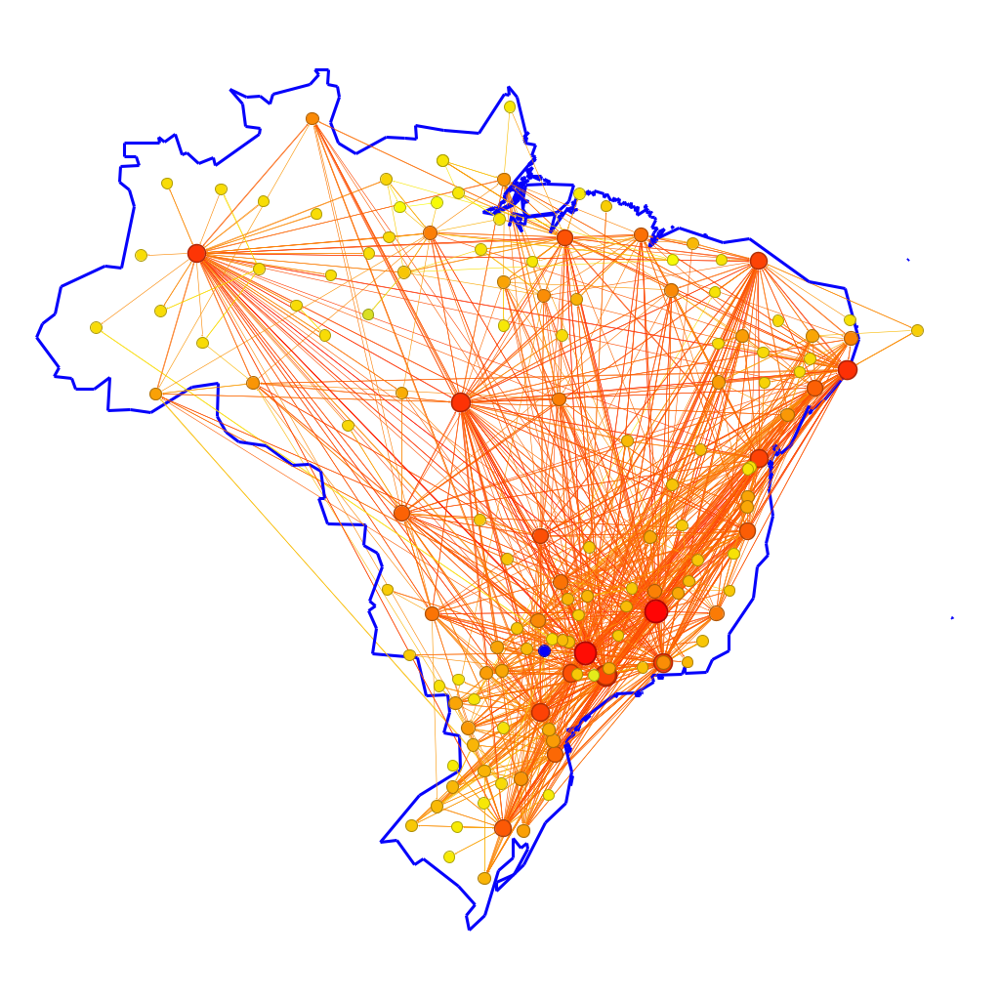
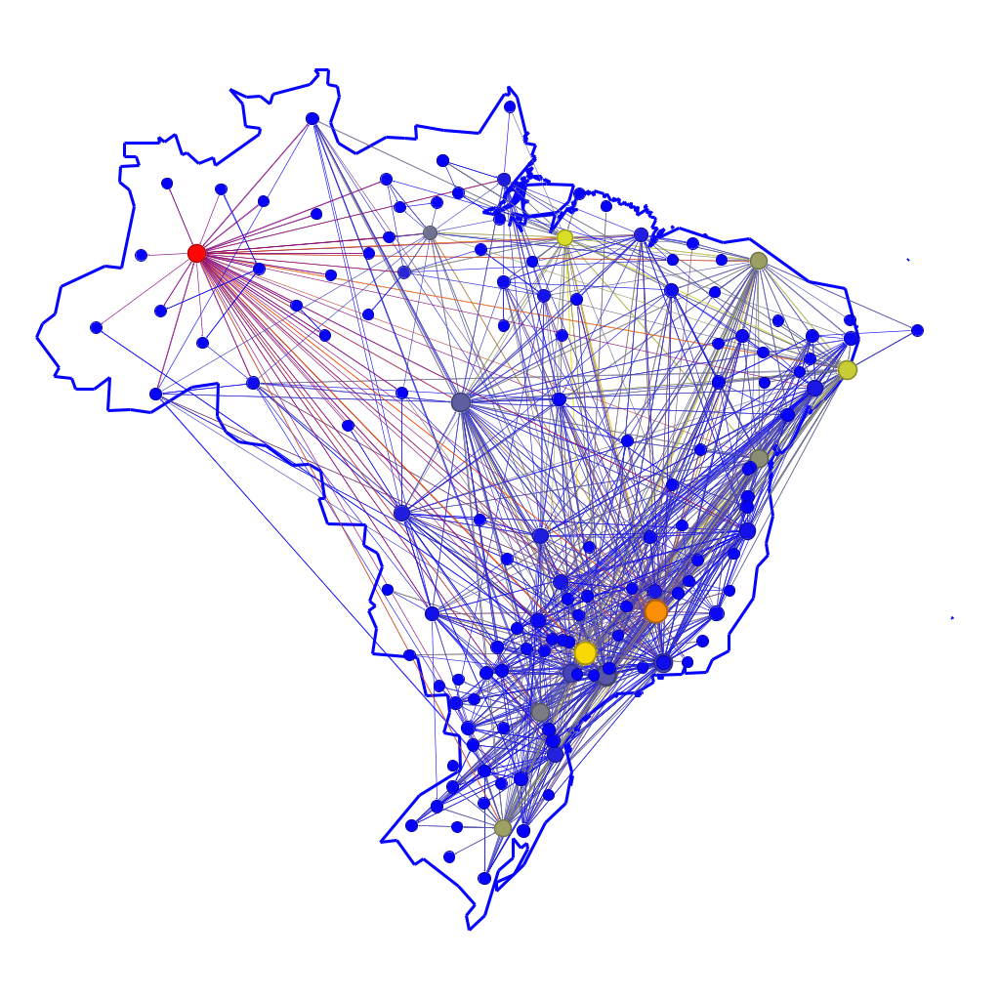
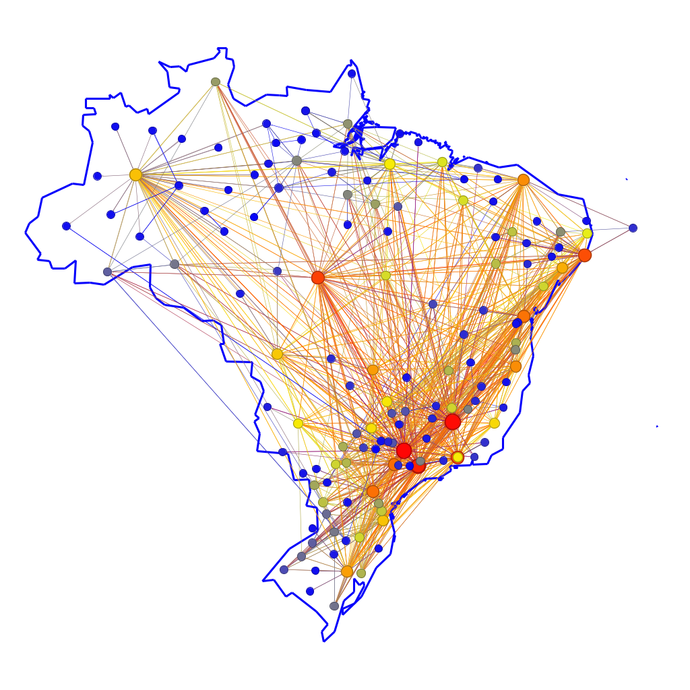
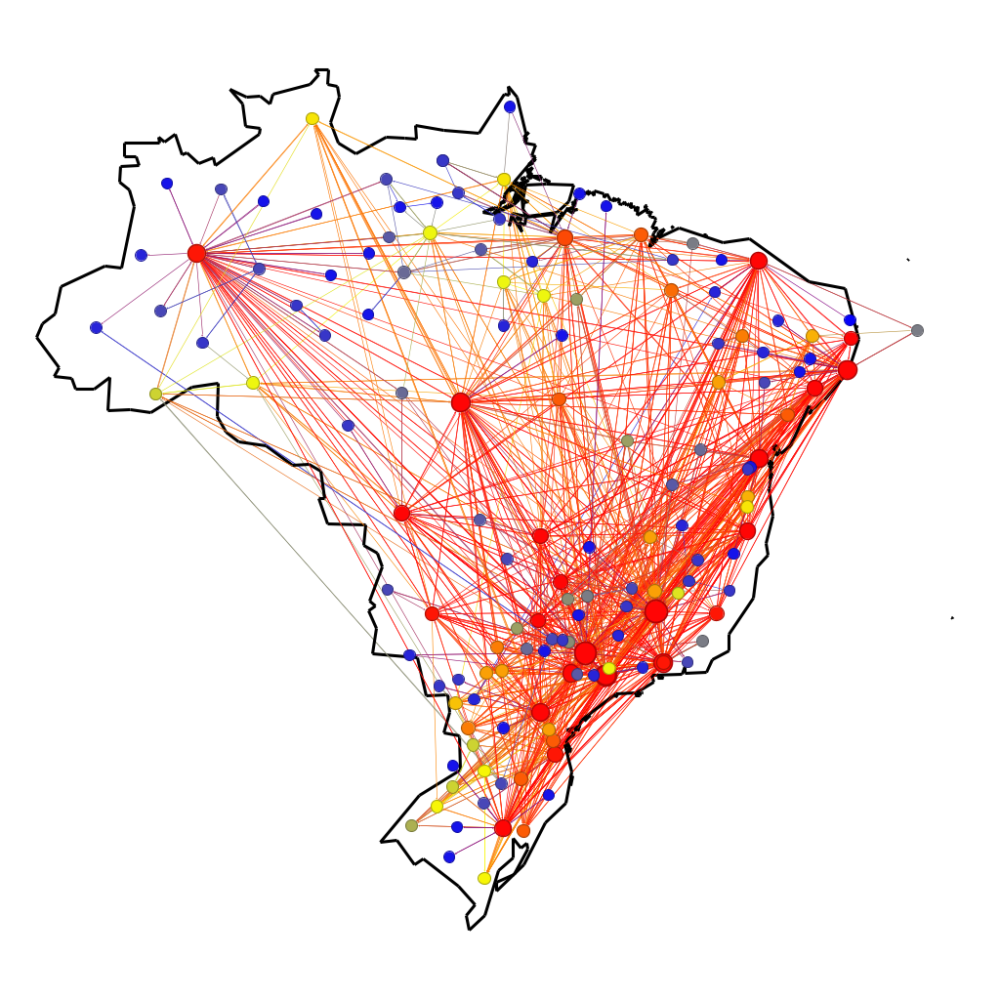
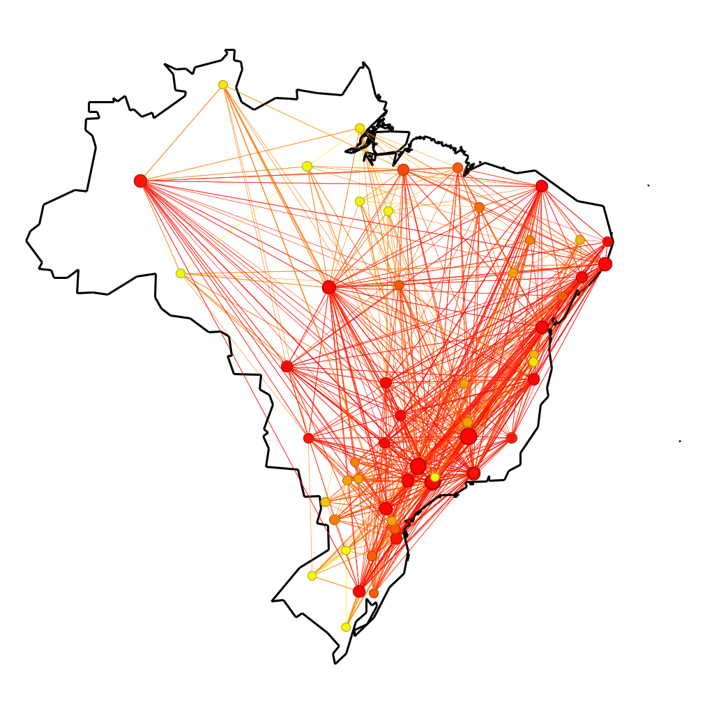
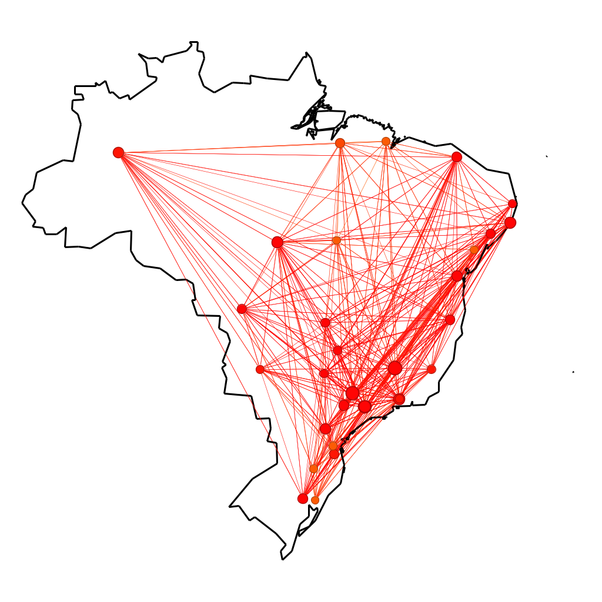
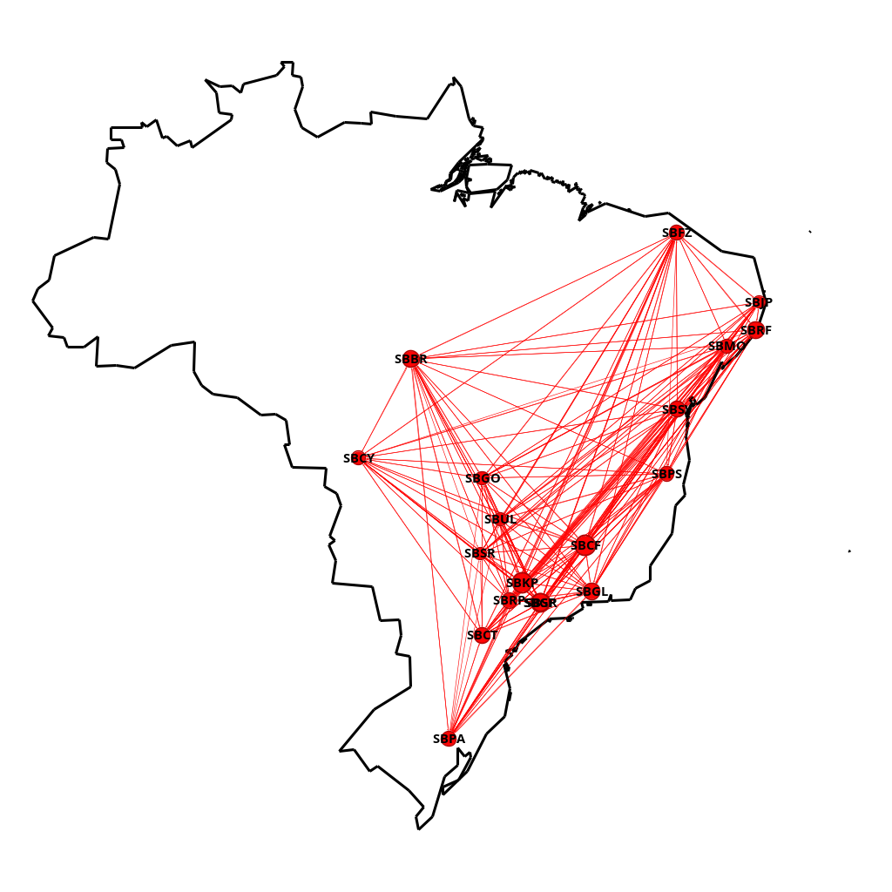
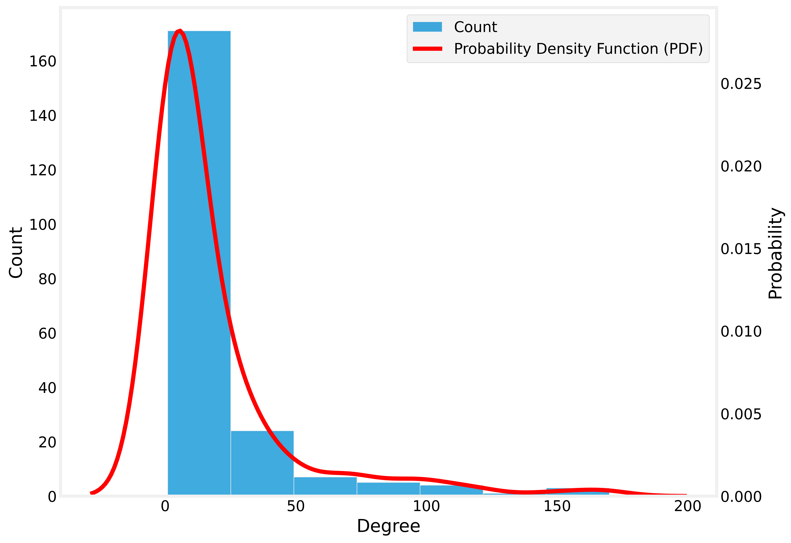
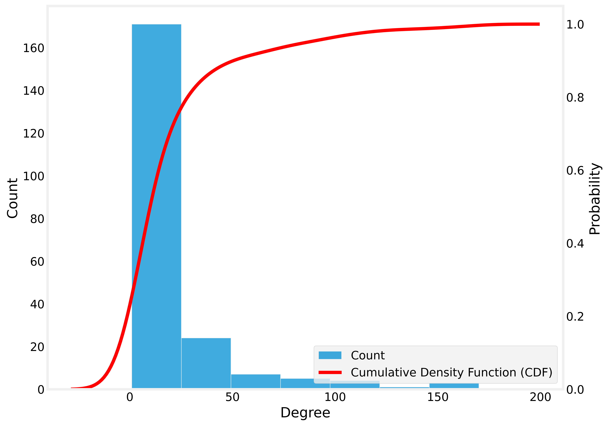

# Análise Estrutural da Malha Aérea Brasileira em 2024

by  
[Daniel Bruno Trindade da Silva](https://github.com/daniel-trindade)  
[Maria Eduarda Lima da Luz](https://github.com/marialluz)  

---

## Vídeo de Apresentação

## Webpage com grafo em produção

---

## 1. Introdução

A malha aérea brasileira constitui uma infraestrutura vital para um país de dimensões continentais como o Brasil, sendo fundamental para a integração econômica, a conectividade social e a logística nacional. O sistema, composto por centenas de aeroportos e milhares de rotas, forma uma teia intrincada de conexões cujo funcionamento e hierarquia não são trivialmente aparentes. Para compreender a sua complexa estrutura e dinâmica, podemos modelá-la como uma rede complexa, aplicando os conceitos da teoria dos grafos para revelar padrões ocultos.

Neste modelo, modelamos os aeroportos como vértices (ou nós) e as rotas de voo diretas que os conectam como arestas (ou links). Essa abordagem nos permite ir além de uma simples análise geográfica, quantificando a importância e o papel de cada aeroporto dentro do sistema aéreo nacional.

O presente relatório tem como objetivo principal analisar a estrutura da malha aérea brasileira utilizando como base de dados todos os voos comerciais registrados pela Agência Nacional de Aviação Civil (ANAC) durante o ano de 2024. Através da ferramenta de visualização e análise de redes Gephi, buscaremos atingir os seguintes objetivos específicos:

1. Identificar os principais hubs aéreos através da análise de métricas de centralidade, como Grau, Centralidade de Intermediação e Centralidade de Autovetor, diferenciando aeroportos de acordo com seu volume de conexões e sua importância como "pontes" na rede.

2. Investigar a coesão e a resiliência da malha por meio da decomposição k-core, destacando o "núcleo" de aeroportos mais densamente conectados que formam o esqueleto estrutural da aviação nacional.

3. Analisar a distribuição estatística das conexões, verificando a hierarquia da rede e identificando os aeroportos que se encontram no centro e na periferia do sistema.

Ao longo deste relatório, cada uma dessas análises será detalhada, acompanhada de visualizações gráficas e interpretações dos resultados, fornecendo um panorama completo da estrutura, hierarquia e funcionamento da aviação comercial no Brasil em 2024.

## 2. Metodologia

A metodologia empregada neste estudo foi estruturada em cinco etapas principais: (1) obtenção e coleta de dados, (2) pré-processamento e filtragem, (3) enriquecimento de dados com coordenadas geográficas, (4) construção do modelo de rede e cálculo de métricas primárias, e (5) análise e visualização gráfica no software Gephi. Essas etapas foram feitas usando o Google Colab, clique [aqui](./processamento_dos_dados.ipynb) para ver o script utilizado.

### 2.1. Obtenção e Coleta de Dados

A base de dados fundamental para esta análise foi extraída do [portal de Dados Abertos da Agência Nacional de Aviação Civil (ANAC)](https://sistemas.anac.gov.br/dadosabertos/Voos%20e%20opera%C3%A7%C3%B5es%20a%C3%A9reas/Voo%20Regular%20Ativo%20%28VRA%29/2024/). Foram utilizados os arquivos referentes à "Base de Dados de Voos e Frequências Aéreas (VRA)", que detalham todos os voos comerciais realizados no espaço aéreo brasileiro. Os dados, disponibilizados em arquivos no formato CSV (Comma-Separated Values) segmentados mensalmente, correspondem a todo o ano de 2024. A primeira etapa consistiu em agregar os 12 arquivos mensais em um único conjunto de dados, que totalizou 987.868 registros de voos, incluindo operações domésticas e internacionais.

### 2.2. Pré-processamento e Filtragem dos Dados

Com o objetivo de isolar o escopo do estudo para a malha doméstica, foi aplicado um filtro para selecionar exclusivamente os voos de natureza nacional. Esta etapa reduziu o universo de análise para 796.923 voos. A seguir, realizou-se uma etapa de seleção de atributos (feature selection) para otimizar o dataset. Colunas que não eram relevantes para a análise estrutural da rede, como informações sobre horários de partida, atrasos e datas específicas, foram descartadas. O dataframe resultante preservou apenas as seguintes colunas essenciais: [ICAO](https://pt.wikipedia.org/wiki/C%C3%B3digo_aeroportu%C3%A1rio_ICAO) Empresa Aérea, Número Voo, Código Tipo Linha, ICAO Aeródromo Origem e ICAO Aeródromo Destino.

### 2.3. Enriquecimento de Dados: Geocodificação dos Aeroportos

Para viabilizar uma visualização geoespacial da rede através do layout GeoLayout do Gephi, onde cada aeroporto é posicionado em sua localização real, foi necessário obter as coordenadas geográficas (latitude e longitude) de cada um dos 215 aeroportos únicos identificados no dataframe. Para isso, foi desenvolvido um script em Python que, utilizando a biblioteca GeoPy e o serviço de geocodificação Nominatim, iterou sobre a lista de códigos [ICAO](https://pt.wikipedia.org/wiki/C%C3%B3digo_aeroportu%C3%A1rio_ICAO) dos aeroportos e buscou suas respectivas coordenadas. As coordenadas de latitude e longitude de cada aeroporto foram então incorporadas ao dataframe principal como novos atributos.

### 2.4. Construção da Rede e Cálculo de Métricas

A partir do dataframe tratado e enriquecido, a rede foi construída. Neste modelo:

- Cada aeroporto único foi definido como um vértice (nó) da rede.

- Uma aresta (link) não-direcionada foi estabelecida entre dois vértices sempre que havia ao menos um voo registrado entre eles.

Posteriormente, um segundo script em Python, utilizando a biblioteca NetworkX, foi empregado para realizar a decomposição k-core da rede. O valor de k-core de cada vértice foi calculado e adicionado como um novo atributo ao grafo, permitindo uma análise posterior de sua coesão estrutural.

### 2.5. Análise e Visualização no Gephi

O grafo final, contendo os vértices, arestas ponderadas, coordenadas geográficas e atributos de k-core, foi exportado em formato GEXF e importado na plataforma de análise de redes Gephi. Dentro do Gephi, foram executados os algoritmos internos para o cálculo de métricas adicionais de centralidade, a Centralidade de Intermediação (Betweenness Centrality) e a Centralidade de Autovetor (Eigenvector Centrality).

Por fim, a plataforma foi utilizada para gerar todas as visualizações gráficas apresentadas neste relatório. Foi aplicado o GeoLayout, para uma visualização geospacial. A aparência dos nós também foi selecionada para mapear metricas. O tamanho dos nós foi determinado pelo numero de rotas que o conecta com outros aeroportos e as cores remetem a cada analise de métrica especifica sempre tomando o azul para valores mais baixos, amarelo para valores intermediários e vermelho para os valores mais altos de cada metrica representada (Grau, K-Core, Centralidades), a fim de ilustrar visualmente os resultados da análise.

## 3. Resultados e Analises

Nesta seção, são apresentados os resultados obtidos a partir da aplicação da metodologia sobre a rede da malha aérea brasileira de 2024. Cada subseção a seguir é dedicada a uma faceta da análise, combinando uma visualização gráfica gerada no software Gephi com uma interpretação descritiva dos padrões e métricas revelados. O objetivo é traduzir os dados estruturais da rede em insights claros sobre a hierarquia, coesão e organização da aviação comercial no país.

### 3.1 Degree (Grau dos nós)

**Figura 1 - Degrees**

A Figura 1 exibe a rede aérea brasileira em seu layout geográfico, com o tamanho e a cor dos nós representando seu número de rotas diretas (Grau). Nós maiores e vermelhos possuem mais conexões. A análise evidencia uma rede altamente centralizada, com os "super-hubs" (nós vermelhos) concentrados na região de São Paulo e em Brasília. A posição geográfica de Brasília destaca seu papel estratégico como principal conector do país. Em um segundo nível, nós amarelos e laranjas funcionam como hubs regionais, enquanto a maioria dos nós (azuis e pequenos) representa aeroportos periféricos dependentes desses centros. Fica claro, portanto, um modelo "hub-and-spoke" bem definido, que domina a distribuição do tráfego aéreo nacional.

### 3.2 Closeness

**Figura 2 - Grafo de Closeness**

A Figura 2 mapeia a Centralidade de Proximidade, que mede quão "perto" um aeroporto está de todos os outros em termos de número de escalas. Nós maiores e vermelhos são mais eficientes em alcançar toda a rede. Diferente da métrica de Grau, que concentra o poder em poucos hubs, a Proximidade mostra uma eficiência mais distribuída. Embora São Paulo e Brasília permaneçam como os pontos mais eficientes, capitais de outras regiões (como Manaus, Recife e Salvador) ganham grande destaque. Isso significa que, mesmo com menos rotas diretas, esses hubs regionais são portais estratégicos que oferecem acesso rápido e eficiente ao resto do país, sendo cruciais para a integração nacional.

### 3.3 Betweenness

**Figura 3 - Grafo de Betweenness**

A Figura 3 mapeia a Centralidade de Intermediação (Betweenness Centrality), uma métrica que identifica os aeroportos que atuam como "pontes" na rede, ou seja, que aparecem com mais frequência nos caminhos mais curtos entre outros pares de aeroportos. Esta análise revela um dos aspectos mais interessantes da malha brasileira. Enquanto os hubs do Sudeste (em laranja e amarelo) mantêm alta intermediação, o destaque absoluto é o aeroporto de Manaus (SBEG), em vermelho. Sua posição geográfica o torna uma ponte indispensável, conectando de forma crítica toda a Região Norte ao restante do país. A remoção ou interrupção de suas operações teria um impacto sistêmico, fragmentando a rede e isolando inúmeras cidades. Fica evidente que, embora não tenha o maior número de voos, sua função de "ponte" é a mais importante de toda a rede para a coesão nacional.

### 3.4 Eigenvector

**Figura 4 - Grafo de Eigenvector**
A Figura 4 apresenta a Centralidade de Autovetor (Eigenvector Centrality). Diferente do Grau, que conta apenas o número de conexões, esta métrica avalia a "qualidade" dessas conexões. Um aeroporto tem alta centralidade de autovetor se estiver conectado a outros aeroportos que também são muito bem conectados, revelando os verdadeiros centros de influência da rede. A análise confirma a dominância do eixo Sudeste-Brasília. Os aeroportos em vermelho e laranja (São Paulo, Rio de Janeiro, Campinas e Brasília) não apenas possuem muitas rotas, mas suas rotas se conectam primariamente entre si e com outros hubs regionais importantes. Isso cria um "clube de elite" que concentra o poder e a influência da malha aérea. Estar conectado a um desses aeroportos é mais significativo do que estar conectado a vários aeroportos periféricos. Portanto, a centralidade de autovetor destaca os nós que são estratégicos não apenas para distribuição, mas para acessar a porção mais influente da rede.

### 3.5 Decomposição k-core

A decomposição k-core é uma técnica poderosa para identificar os subgrupos mais coesos e robustos de uma rede. O método funciona "descascando" a rede em camadas, removendo iterativamente os nós menos conectados. Um nó pertence ao k-core se ele possui pelo menos k conexões com outros nós que também pertencem ao k-core. Esta análise revela a espinha dorsal da malha aérea, mostrando como a rede se sustenta em um núcleo de aeroportos altamente interligados.

O processo de decomposição é visualizado a seguir em suas etapas mais significativas:

### 3.5.1 A Rede Conectada (1-core)

Figura 5 - 1-core

A Figura 5 exibe o 1-core, que essencialmente representa toda a rede conectada. Nesta fase, vemos a estrutura completa, com um grande número de nós periféricos (em azul) que possuem poucas conexões e formam as camadas mais externas da rede, ou seja, aqueles com o menor valor de k-core. Isso tem implicações diretas e muito significativas sobre seu papel e suas características:

- Função de "Capilaridade": Esses nós são, em sua maioria, aeroportos regionais que atendem a cidades menores ou mais remotas. Eles funcionam como os "capilares" da malha aérea, sendo os pontos de entrada e saída da rede para uma vasta porção do território nacional. Sem eles, a aviação ficaria restrita apenas aos grandes centros.

- Dependência dos Hubs: Por terem poucas conexões, esses aeroportos são altamente dependentes dos hubs centrais (os nós amarelos e vermelhos). Um passageiro que parte de um "nó azul" quase sempre precisará fazer uma ou mais conexões em um hub para chegar a um destino final que não seja um de seus poucos vizinhos diretos. Eles são a materialização do modelo "hub-and-spoke", onde os nós azuis são os "spokes" (raios) e os nós centrais são os "hubs" (eixos).

- Vulnerabilidade Estrutural: O fato de serem os primeiros a serem "descascados" na decomposição k-core significa que são os mais frágeis estruturalmente. Se um aeroporto regional (azul) possui apenas uma ou duas rotas e uma delas é interrompida, ele corre o risco de ficar completamente isolado da rede aérea nacional. Sua baixa conectividade os torna mais vulneráveis a cancelamentos de rotas ou a problemas operacionais nos hubs dos quais dependem.

### 3.5.2 O Núcleo Coeso (14-core)

Figura 6 - 14-core

Ao aumentar a exigência para k=14, a rede se contrai drasticamente. A Figura 6 mostra o 14-core. Todos os nós periféricos foram removidos, restando apenas um subgrupo de aeroportos onde cada um mantém pelo menos 14 conexões com os outros membros deste mesmo grupo. Este é o núcleo coeso da rede, formado majoritariamente por capitais e hubs regionais.

### 3.5.3 O Núcleo Denso (24-core)

Figura 7 - 24-core
Elevando o requisito para k=24, como visto na imagem Figura 7, chegamos a um núcleo ainda mais denso e refinado. Este grupo representa a elite da conectividade nacional, um conjunto de aeroportos com um nível de interconexão altíssimo, formando o backbone estrutural da malha aérea.

### 3.5.4 O Núcleo Principal Identificado (29-core)

Figura 8 - Núcleo Principal (29-core)
Finalmente, a Figura 8 isola e identifica os aeroportos que sobrevivem ao filtro mais rigoroso, formando o 29-core. Este é o grupo de aeroportos mais coeso e resiliente de todo o Brasil. Os membros deste núcleo são:

- SBGR (Guarulhos)
- SBKP (Campinas)
- SBGL (Galeão)
- SBCF (Confins)
- SBBR (Brasília)
- SBSV (Salvador)
- SBRF (Recife)
- SBFZ (Fortaleza)
- SBPA (Porto Alegre)
- SBCT (Curitiba)
- SBRP (Ribeirão Preto)
- SBSR (São José do Rio Preto)
- SBCY (Cuiabá)
- SBGO (Goiânia)
- SBUL (Uberlândia)
- SBPS (Porto Seguro)
- SBMO (Maceió)
- SBJP (João Pessoa)

A existência deste 29-core demonstra que a rede aérea brasileira, embora vasta, depende da integridade de um grupo pequeno e ultra-conectado de aeroportos. A alta coesão deste núcleo garante eficiência e resiliência, mas também o torna um ponto crítico de vulnerabilidade para toda a malha nacional.

### 3.6 Análise da Distribuição de Graus (PDF e CDF)

Para entender o perfil de conectividade da rede, analisamos a Função de Densidade de Probabilidade (PDF) e a Função de Distribuição Acumulada (CDF) do grau dos nós.

Figura 9 - Função de Densidade de Probabilidade (PDF) de Graus

O gráfico da PDF (Figura 9) revela uma característica típica de redes complexas do mundo real: uma distribuição de cauda longa (long tail). A grande maioria dos aeroportos (o pico do histograma à esquerda) possui um número muito baixo de conexões diretas. Estes são os vértices no extremo esquerdo da distribuição – os aeroportos regionais e periféricos. Em contrapartida, uma pequena minoria de aeroportos, que formam a cauda longa à direita, possui um número altíssimo de conexões. Estes são os vértices no extremo direito da distribuição – os super-hubs como Guarulhos, Brasília e Campinas, que centralizam a malha.

Figura 10 - Função de Distribuição Acumulada (CDF) de Graus

A CDF (Figura 10) confirma e quantifica essa desigualdade. A curva sobe vertiginosamente no início, mostrando que uma grande porcentagem de nós se acumula rapidamente nos níveis mais baixos de grau. Analisando a curva, podemos estimar as faixas de grau:

- 25% dos aeroportos possuem um grau baixíssimo, provavelmente menor que 5.

- 50% da rede (a mediana) é composta por aeroportos com grau inferior a aproximadamente 15.

- 75% de todos os aeroportos da malha possuem menos de 30 conexões diretas.

Isso significa que três quartos da infraestrutura aeroportuária do país opera com um número limitado de rotas, dependendo do quarto restante (os 25% mais conectados) para garantir a conectividade nacional.

### 3.7 Análise Multivariada das Métricas de Centralidade

Para identificar os nós centrais e periféricos de forma mais robusta, realizamos uma análise multivariada, cruzando as quatro métricas de centralidade calculadas.

Figura 11 - Matriz de correlação entre as métricas de centralidade

A matriz de gráficos da Figura 11 nos permite visualizar as relações entre as métricas:

- Vértices no Centro da Rede: Os aeroportos centrais são aqueles que pontuam alto em múltiplas métricas. Eles se localizam na extremidade superior direita da maioria dos gráficos de dispersão. Observamos uma forte correlação positiva entre Grau, Proximidade e Autovetor. Isso indica que os aeroportos com mais conexões (Grau) tendem a ser os mais eficientes para alcançar a rede (Proximidade) e os mais influentes (Autovetor). Este grupo é inequivocamente o núcleo da rede, formado pelos grandes hubs.

- Vértices na Periferia da Rede: Os aeroportos periféricos são aqueles agrupados na extremidade inferior esquerda (próximo à origem 0,0) em todos os gráficos. Eles possuem valores baixos de Grau, Proximidade, Intermediação e Autovetor, confirmando seu papel secundário na estrutura da rede.

- Correlações e Casos Especiais: A relação com a Intermediação (Betweenness) é a mais dispersa. Embora siga uma tendência positiva, ela mostra que um aeroporto não precisa ter o maior grau para ser uma "ponte" crucial. Vértices que estão altos no eixo da Intermediação, mas não tão à direita no eixo do Grau, representam aeroportos estrategicamente localizados que, como Manaus (SBEG), são vitais para a coesão da rede, mesmo sem ter o maior número absoluto de voos.

## 4. Conclusão

A análise estrutural da malha aérea brasileira em 2024 revelou um sistema altamente centralizado, caracterizado por uma forte hierarquia entre aeroportos periféricos, regionais e super-hubs. A modelagem da rede como um grafo permitiu a aplicação de métricas de centralidade e técnicas como a decomposição k-core, resultando em insights valiosos sobre a organização, resiliência e eficiência da infraestrutura aérea nacional.

As métricas de centralidade destacaram a dominância do eixo Sudeste–Centro-Oeste, com Guarulhos, Brasília e Campinas se consolidando como nós centrais em todas as análises. Contudo, a Centralidade de Intermediação evidenciou aeroportos como Manaus, que, apesar de menos conectados, desempenham um papel crítico como pontes estruturais, garantindo a integração de regiões remotas ao restante da malha.

A decomposição k-core revelou o núcleo coeso e resiliente da rede, culminando em um grupo seleto de 18 aeroportos que formam o 29-core — o esqueleto da aviação brasileira. Esses aeroportos não apenas concentram conexões, mas garantem a robustez da malha mesmo diante de falhas pontuais.

As distribuições de grau (PDF e CDF) evidenciaram a desigualdade estrutural da rede: enquanto poucos hubs concentram um número elevado de conexões, a maioria dos aeroportos opera com conectividade limitada e alta dependência dos grandes centros. Isso aponta tanto para a eficiência do modelo "hub-and-spoke" quanto para vulnerabilidades em caso de falhas nesses nós centrais.

Por fim, a análise multivariada confirmou a coerência entre as métricas e permitiu uma visão integrada dos papéis desempenhados por cada aeroporto. A rede aérea brasileira, embora vasta e capilarizada, depende fortemente da integridade de um pequeno grupo de vértices para manter sua coesão e acessibilidade.

Este estudo, ao combinar rigor técnico com visualizações intuitivas, oferece um panorama abrangente da malha aérea nacional, podendo servir como base para planejamentos estratégicos, políticas públicas de infraestrutura e melhorias na conectividade regional e nacional.
